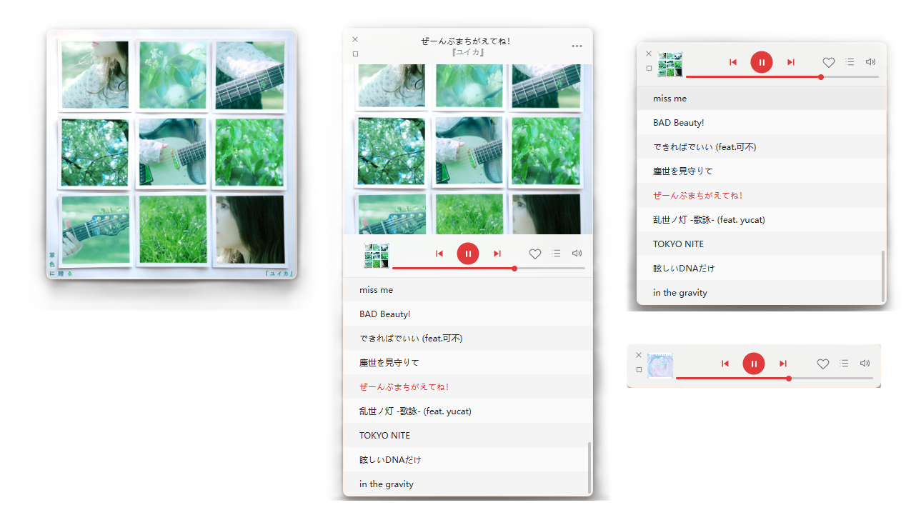

# ohMyCloudmusic

一个以 **Windows Mini 播放体验**为核心的非官方网易云音乐桌面客户端。

macOS 版网易云音乐提供了较完整的 Mini 播放器，而 Windows 官方客户端缺少相近的封面窗口与横条模式。这个项目因此基于 [Tauri 2](https://tauri.app/) 和网易云音乐 Web Player，为 Windows 补充一套可长期置顶、可切换布局、可查看播放列表的 Mini 播放器。

> 本项目是非官方客户端，与网易云音乐及杭州网易云音乐科技有限公司无关。



从左到右依次展示：纯封面模式、封面与播放列表、横条与播放列表、纯横条模式。

## Mini 模式

### 封面模式

- 以当前歌曲封面作为主界面，窗口保持 `1:1`。
- 鼠标移入后显示顶部歌曲信息和底部播放工具栏。
- 支持上一首、播放/暂停、下一首、喜欢、播放列表和音量调节。
- 双击封面可切换歌词显示。
- 可自由调整窗口宽度，封面和播放列表会同步适配。

### 横条模式

- 将封面窗口收回为紧凑的 `60px` 播放横条。
- 与封面模式共享窗口宽度和播放控件位置。
- 可以随时重新展开封面，不需要返回完整界面。
- 切换前已经打开的播放列表会继续保留。

### 播放列表

- 封面模式和横条模式都可以展开当前播放列表。
- 当前歌曲以红色高亮显示。
- 列表只显示歌曲名称，点击歌曲即可切换播放。
- 长列表采用虚拟渲染，数千首歌曲也不会一次创建全部 DOM 节点。
- 支持独立滚动条，并自动定位当前歌曲。

### 歌曲菜单

封面模式右上角的三个点会打开当前歌曲菜单。菜单信息直接读取网易云播放器的当前播放状态，包括：

- 歌手
- 专辑
- 播放来源，例如“每日歌曲推荐”

评论、收藏、分享、歌手和专辑等操作会先恢复完整模式，再调用完整版中对应的真实控件或页面入口。菜单还提供复制歌曲链接和从当前播放列表删除等操作。

### 音量调节

点击音量图标会在播放器上方显示紧凑的音量浮层。拖动滑块时，客户端通过网易云内部的 `playing/setVolume` 状态更新实时调整音量；点击其他区域后浮层自动关闭。

### 窗口行为

- Mini 窗口默认保持在其他窗口上方。
- 支持拖动、隐藏和恢复完整界面。
- 记忆 Mini 模式、窗口位置、共享宽度、播放列表高度和置顶状态。
- 关闭应用后再次启动，可以恢复上次使用的 Mini 布局。

## 其他能力

Mini 模式是本项目的主要功能，同时客户端还提供：

- 直接加载网易云音乐 Web Player。
- 无边框完整窗口和自定义窗口控制按钮。
- 网易云音乐 App 扫码登录。
- 系统托盘、当前歌曲信息和播放控制。
- 关闭到托盘和单实例运行。
- 全局播放快捷键。
- 自定义 User-Agent，避免暴露桌面 WebView 容器标识。

## 平台支持

| 平台 | 状态 | WebView |
| --- | --- | --- |
| Windows 10/11 | 主要支持 | Microsoft Edge WebView2 |
| Linux | 实验性 | WebKitGTK 4.1 |

Mini 窗口动画、圆角裁剪和弹出菜单目前主要围绕 Windows 进行开发和验证。Linux 下的托盘、窗口动画和全局快捷键表现可能因桌面环境、Wayland/X11 和 WebKitGTK 版本而不同。

## 快捷键

| 快捷键 | 操作 |
| --- | --- |
| `Ctrl+Alt+P` | 播放/暂停 |
| `Ctrl+Alt+Left` | 上一首 |
| `Ctrl+Alt+Right` | 下一首 |

全局快捷键可能与系统或其他应用冲突。注册失败不会阻止客户端启动，但对应快捷键将不可用。

## 使用

### 登录

1. 点击完整界面中的登录入口，或在托盘菜单中选择“登录”。
2. 使用网易云音乐 App 扫描二维码。
3. 在手机端确认授权。
4. 客户端写入登录 Cookie 并刷新播放器。

### 进入 Mini 模式

点击注入到网易云完整界面导航栏中的 Mini 按钮。进入后可以：

1. 将鼠标移入封面，显示歌曲信息和播放工具栏。
2. 点击左下角小封面，在封面模式与横条模式之间切换。
3. 点击播放列表图标，展开或收起当前队列。
4. 点击右上角三个点，打开当前歌曲菜单。
5. 点击左上角恢复按钮，返回完整界面。

### 托盘与退出

- 点击关闭按钮只会隐藏主窗口，不会退出应用。
- 单击托盘图标可以显示或隐藏窗口。
- 再次运行程序会唤起已有实例。
- 如需完全退出，请使用托盘菜单中的“退出”。

## 环境要求

通用依赖：

- [Node.js](https://nodejs.org/) 20 或更高版本
- [pnpm](https://pnpm.io/) 10
- [Rust](https://www.rust-lang.org/tools/install) stable

Windows 还需要：

- Visual Studio 2022 Build Tools
- “使用 C++ 的桌面开发”工作负载
- Windows 10/11 SDK
- Microsoft Edge WebView2 Runtime

Windows 10 和 Windows 11 通常已经安装 WebView2 Runtime。

Linux 需要 WebKitGTK 4.1、AppIndicator、OpenSSL、GTK 和基础编译工具。Ubuntu/Debian 可执行：

```bash
sudo apt update
sudo apt install -y \
  build-essential \
  curl \
  file \
  libayatana-appindicator3-dev \
  librsvg2-dev \
  libssl-dev \
  libwebkit2gtk-4.1-dev \
  libxdo-dev \
  pkg-config \
  wget
```

## 开发

安装依赖并启动开发版本：

```bash
pnpm install
pnpm dev
```

检查 Rust 代码：

```bash
cd src-tauri
cargo check
cargo test
```

## 构建

```bash
pnpm build
```

常见输出位置：

```text
src-tauri/target/release/
src-tauri/target/release/bundle/
```

Windows 通常生成 NSIS/MSI 安装包。Tauri 不支持在 Windows 上直接交叉生成 Linux 图形应用安装包，请在对应系统或 CI Runner 中分别构建。

## 项目结构

```text
.
├─ imgs/                         # README 截图
├─ src/
│  ├─ inject/
│  │  ├─ mini-player.js          # Mini 布局、队列和交互
│  │  ├─ netease-adapter.js      # 网易云状态与播放操作适配
│  │  ├─ media-controller.js     # 媒体状态同步
│  │  └─ styles.js               # 注入页面的界面样式
│  ├─ login.html                 # 扫码登录界面
│  ├─ song-menu.html             # 当前歌曲菜单
│  ├─ tray.html                  # 托盘窗口
│  └─ volume-popup.html          # 音量调节浮层
├─ src-tauri/
│  ├─ capabilities/              # Tauri 权限配置
│  ├─ icons/                     # 应用图标
│  └─ src/
│     ├─ lib.rs                  # 应用、窗口和原生命令
│     ├─ login.rs                # 登录窗口
│     ├─ media.rs                # 媒体状态
│     ├─ netease.rs              # 二维码登录 API
│     └─ tray.rs                 # 系统托盘
├─ package.json
└─ pnpm-lock.yaml
```

## 工作原理

Rust 使用 Tauri 创建无边框 WebView2 窗口并加载网易云 Web Player。`src/inject/` 中的脚本作为 initialization script 注入页面，读取网易云播放器状态并构建 Mini 界面。

封面与横条之间的切换只操作原播放器窗口。Windows 下通过原生窗口区域裁剪完成过渡，避免逐帧缩放 WebView2 导致封面和播放列表频繁重绘。歌曲菜单和音量调节使用独立的轻量弹层，在失去焦点后自动隐藏。

播放状态、队列、歌曲来源、歌手和专辑信息优先从网易云内部 Store 读取。评论、收藏和分享等操作则复用完整版中的真实控件，减少重复实现网易云业务逻辑。

## 已知限制

- 客户端依赖网易云 Web Player 的页面结构和内部 Store，网页更新后可能需要同步调整选择器或 action。
- Mini 模式的原生窗口动画主要针对 Windows WebView2 实现。
- 评论、收藏、分享、歌手和专辑跳转依赖完整版对应控件已经加载。
- 二维码登录依赖网易云非公开 Web API，接口变化后可能失效。
- 当前没有自动更新功能。
- 应用需要联网，离线播放不在当前范围内。

## 隐私与免责声明

- 登录 Cookie 由 WebView 管理，不会写入项目源码。
- 客户端会连接网易云音乐及其资源域名。
- 请勿提交个人 Cookie、调试日志或本地构建产物。
- 本项目仅用于学习和个人使用，请遵守网易云音乐服务条款、当地法律法规及内容版权要求。
- 本项目不提供音乐破解或付费内容绕过功能。

## 贡献

欢迎提交 Issue 或 Pull Request。涉及 Mini 模式时，请重点验证：

- 封面模式和横条模式的双向切换
- 播放列表打开时的布局切换
- 窗口 resize 后的封面与队列布局
- 歌曲菜单和音量浮层的失焦关闭
- Windows 缩放比例不为 `100%` 时的位置与尺寸

提交前建议至少执行：

```bash
cd src-tauri
cargo check
cargo test
```
